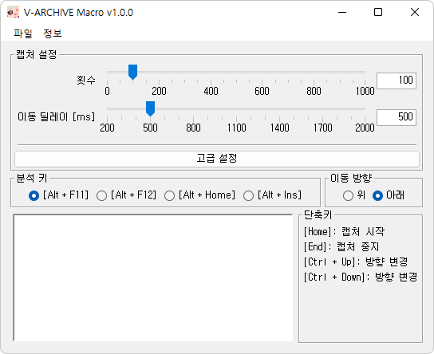

# VArchiveMacro

VArchiveMacro는 로키 스튜디오(Rocky Studio)가 개발, 네오위즈(NEOWIZ)가 배급하는 PC 플랫폼 게임
[DJMAX RESPECT V](https://store.steampowered.com/app/960170/DJMAX_RESPECT_V/)의 유저 제작 웹 성과 관리 도구
[V-ARCHIVE](https://v-archive.net/)의 클라이언트 캡처 자동화를 지원하는 외부 매크로 프로그램 입니다.

현재 기록 뷰어와 콜렉션 메뉴 스캔 기능을 포함한 1.1 버전이 개발중에 있습니다.

## 기능

- **기록 뷰어**: 컴퓨터에 저장된 기록을 보여줍니다.
- **스캐너**: 인게임 콜렉션 메뉴를 통해 기록을 스캔합니다.
- **매크로**: V-ARCHIVE 클라이언트의 캡처 자동화를 도와주는 매크로 기능입니다.

## 설치 안내

사용을 위해서는 *JRE 17 (Java Runtime Environment 17)* 이 필요합니다.

JRE설치 환경에 따라 다음 세 가지 실행 파일을 제공합니다.

- `VArchive Macro vX.X.X.exe`: 시스템 전역에 설치되어 있는 JRE를 사용합니다.
  [JavaSoft 레지스트리 키](https://docs.azul.com/core/zulu-openjdk/install/windows#azul-zulu-registry-keys)
  를 제공하는 JRE를 설치하였을 경우 사용 가능합니다.
- `VArchive Macro env vX.X.X.exe`: `%JAVA_HOME%` 환경 변수로 지정된 JRE를 사용합니다.
- `VArchive Macro local vX.X.X.exe`: 로컬에 설치된 JRE를 이용합니다.
  참조하는 JRE의 루트 폴더는 실행 파일과 동일한 경로에 `jre17` 이름으로 존재해야 합니다.

## 사용법

- 기록 뷰어
  1. 좌측 패널에서 곡 이름을 선택하여 기록을 확인합니다.

  - 첫 실행 시에는 서버로부터 기록을 다운받아야 합니다.

- 스캐너
  1. 기록 뷰어에서 기록을 다운받고 설정에서 계정 파일 및 캐시 디렉토리를 선택합니다.
  1. ***예상 곡 목록* 창을 열어 인게임에서 출력된 곡 순서가 동일한지 확인합니다. (중요)**
  1. 출력 순서가 동일한 탭은 스캔이 가능한 탭이므로 선택, 그렇지 않다면 선택을 해제합니다.
  1. 인게임 콜렉션 메뉴의 `ALL` 탭이 표시되도록 놓은 뒤 `Ctrl + Home`을 눌러 스캔합니다.
  1. 스캔이 완료되면 캡처한 사진 분석 후 결과 화면에 표시됩니다.
  1. 태스크 및 결과 화면에서 스캔 결과를 확인 및 업로드할 기록 데이터를 선택하여 업로드 합니다.

- 매크로
  1. 인게임 프리스타일 모드에서 난이도 순서로 정렬합니다.
  1. `Alt + [` 또는 `Alt + ]`을 눌러 매크로를 실행합니다.

  - 사용 시 V-ARCHIVE 클라이언트가 실행되어 있어야 합니다.

### 단축키

- `Ctrl + Home`: 콜렉션 메뉴 스캔을 시작합니다.
- `Alt + [`: 위 방향으로 클라이언트 매크로를 시작합니다.
- `Alt + ]`: 아래 방향으로 클라이언트 매크로를 시작합니다.
- `End`: 진행중인 작업을 중단합니다.

### 제한 및 주의사항

현재 v1.1.0은 개발중인 알파 버전으로 다음과 같은 제한 및 주의사항이 존재합니다.

1. 스캐너 지원 해상도

    스캐너는 빠른 스캔을 위해 매크로 기능과 다르게 자체 캡처 기능을 사용합니다.
    이 때문에, 현재 개발 버전 기준으로는 아직 **창모드 스캔을 지원하지 않습니다.**
    또한 다중 모니터 환경에서의 스캔 기능은 테스트 되지 않아 사용 가능 여부가 불확실합니다.

    현재 지원 해상도는 다음과 같습니다.
    - FHD (1920 x 1080), 전체화면 / 보더리스 창모드

1. **곡 순서 및 표시 여부 확인 필수 (중요)**

    *이 문제점은 차후 베타 버전에서 곡 인식 기능을 구현하며 해결할 계획입니다.*

    스캐너 기능은 현재 `alpha1` 개발 버전 기준으로 캡처한 곡이 어떠한 곡인지 직접적으로 인식하지 않고
    사용자가 선택한 탭을 우선 캡처 후 및 캡처한 순서대로 프로그램 내에 사전에 정의한 곡 리스트와
    1:1로 대응시키도록 되어있습니다.

    곡 대응에 있어 인게임 콜렉션 메뉴에서 곡의 표시 여부는 플레이 기록에 따라 달라집니다.
    DLC를 소유하였더라도 플레이 기록이 없으면 콜렉션 메뉴에 뜨지 않고, DLC를 소유하지 않았더라도
    온라인 모드 등의 다른 방법을 통해 플레이한 기록이 있다면 콜렉션 메뉴에 표시됩니다.

    정확한 스캔을 위해 스캐너 기능을 사용하기 전에 스캔할 DLC 탭을 선택하고
    *예상 곡 목록* 기능으로 콜렉션 메뉴에 실제로 표시되는 곡을 비교 확인할 필요가 있습니다.
    비교하여 모든 곡이 프로그램에서 제시하는 순서와 같이 표시된다면 해당 탭은 스캔이 가능한 탭이며,
    그렇지 않다면 스캔이 불가능한 탭입니다.

1. 스캐너 사용 시 인게임 언어 설정이 `한국어 (Korean)`로 설정되어 있어야 합니다.

    1:1 곡 대응에 사용되는 사전 정의 리스트는 한국어 곡명 기준으로 정렬되어 있습니다.
    게임 언어가 다른 언어로 설정되어 있는 경우 콜렉션 리스트의 곡 표시 순서가 달라져 스캔 결과가 부정확해집니다.

1. 캡처 중 키보드 및 마우스를 조작하지 마세요. 캡처가 잘못될 가능성이 있습니다.

## 설정

- 공통
  - 슬라이더: 슬라이더를 이용하는 설정값은 마우스 우클릭으로 기본값 초기화가 가능합니다.
    또한 우측의 텍스트 입력란에 값을 입력하여 슬라이더 입력 범위를 일부 초과하는 값을 설정할 수 있습니다.
  - 캡처 딜레이: 캡처 직전 기다리는 시간을 지정합니다.
    저사양 컴퓨터 또는 다른 고부하 작업을 동시에 진행하는 경우 등 화면 업데이트가 느려지거나 렉이 발생하는 경우
    이를 늘려 잘못 스캔되는 문제를 해결할 수 있습니다.
  - 키 입력 지속시간: 키를 누르고 있는 시간을 지정합니다.
    키 입력이 무시될 경우 이를 올려주세요.

- 스캐너
  - 계정 파일: `account.txt` 파일 경로를 지정합니다. 기록 업로드 시 계정 인증에 사용됩니다.
  - 캐시 디렉토리: 스캔 과정 중 캡처한 사진을 임시 저장할 경로를 지정합니다.
    *FHD(1920x1080)* 기준으로 약 **500MB**가 사용됩니다.
  - 기록 업로드 딜레이: 기록 업로드 사이 기다리는 시간을 지정합니다.
    서버의 부하를 낮추기 위해 사용하는 설정값입니다.
  - 캡처 딜레이: 공통 항목 참조.
  - 키 입력 지속시간: 공통 항목 참조.

- 매크로
  - 분석 키: V-ARCHIVE 클라이언트에서 분석하기 위해 사용할 키를 지정합니다.
  - 횟수: 매크로를 실행할 횟수를 지정합니다.
  - 캡처 딜레이: 곡 이동 후 캡처 전 기다리는 시간을 지정합니다.
    매크로의 경우, 이 값이 너무 작으면 곡 이동 중 캡처되어 V-ARCHIVE 클라이언트에서 정확한 분석을 할 수 없습니다.
  - 캡처 지속시간: 캡처에 사용되는 시간을 지정합니다. 캡처가 되지 않는 등의 문제가 발생하는 경우 이 값을 올려주세요.
  - 키 입력 지속시간: 공통 항목 참조.

## 알려진 문제

- 매크로
  - *클라이언트에 "지원하지 않는 해상도 NxM" 라는 메시지가 뜨며 캡처가 되지 않습니다.*

    게임 윈도우가 포커스 되지 않았을 가능성이 있습니다. 게임 윈도우를 한 번 클릭해 주세요.

    매크로는 스캐너 기능과 다르게 윈도우의 프린터 스크린샷 기능을 이용하여 캡처합니다.
    게임 화면만을 정확히 캡처하기 위해 `Alt + PrtSc` 키를 이용하는데, 이는 현재 포커스
    되어있는 창만 잘라내어 캡처하는 기능입니다. 지원하는 해상도 이외에 다른 해상도 크기가
    지원되지 않는다는 메시지의 경우 이 포커스가 게임 윈도우가 아닌 다른 윈도우에 맞추어졌을
    수 있습니다. 그림판을 켜고 붙여넣기를 하면 마지막으로 캡처된 화면을 볼 수 있습니다.

- 스캐너
  - *스캔한 곡을 다른 곡으로 인식합니다. / 곡이 중복되서 스캔됩니다.*

    현재 알파 개발 버전에서 곡을 직접적으로 인식하지 않아 발생하는 문제입니다.
    콜렉션 메뉴에서 곡은 플레이 기록이 있을 때에만 표시됩니다. 플레이 기록이 없는 곡은
    최소 1회씩 플레이하여 콜렉션 메뉴에 표시될 수 있도록 해주세요.

    프로그램의 *예상 곡 목록* 기능을 이용하여 비교하면 어떤 곡이 누락되었는 확인할 수 있습니다.
    DLC 탭 단위로 스캔을 끊어 진행하므로 최소 탭 단위로는 일치하도록 맞추어주세요.

## 업데이트 내역

- v1.1.0-alpha1-hotfix1
  - 스캐너에서 곡과 캡처한 이미지를 잘못 매칭하는 버그 개선
    - 일부 탭을 고정에서 해제하여 스캔 가능하도록 변경
    - 스캐너 사용 방법 변경

- v1.1.0-alpha1
  - 개발중인 기록 뷰어 및 스캐너 기능 추가

- v1.0
  - 첫 릴리즈

## 기타

- *VArchiveMacro의 앱 아이콘은 Over Me 곡의 커버 이미지에서 가져왔으며 이의 저작권은 NEOWIZ 사에 있습니다.*
