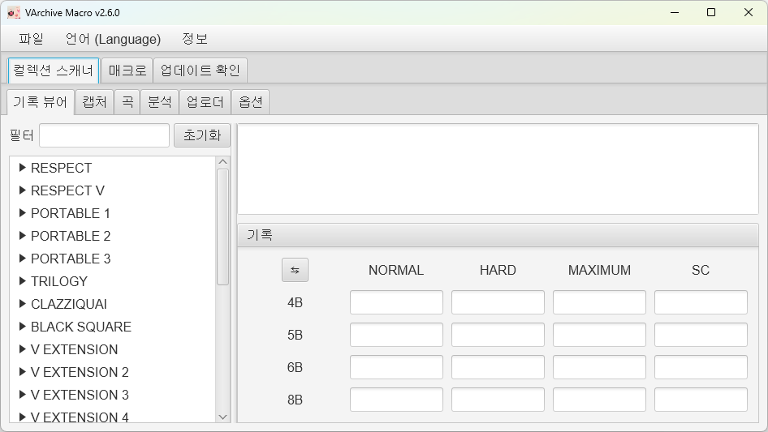

# VArchiveMacro

VArchiveMacro는 로키 스튜디오(Rocky Studio)가 개발, 네오위즈(NEOWIZ)가 배급하는 PC
플랫폼 게임
[DJMAX RESPECT V](https://store.steampowered.com/app/960170/DJMAX_RESPECT_V/)의
유저 제작 웹 성과 관리 도구
[V-ARCHIVE](https://v-archive.net/)의 클라이언트 캡처 자동화를 지원하는 외부 매크로
프로그램 입니다.

현재 기록 뷰어와 콜렉션 메뉴 스캔 기능을 포함한 1.1 버전이 개발중에 있습니다.

## 설치 안내

사용을 위해서는 *JRE 17 (Java Runtime Environment 17)* 이 필요합니다.

JRE설치 환경에 따라 다음 세 가지 실행 파일을 제공합니다.

- `VArchive Macro vX.X.X.exe`

  시스템 전역에 설치되어 있는 JRE를 사용합니다.
  [JavaSoft 레지스트리 키](https://docs.azul.com/core/zulu-openjdk/install/windows#azul-zulu-registry-keys)
  를 제공하는 JRE를 설치하였을 경우 사용 가능합니다.

- `VArchive Macro env vX.X.X.exe`

  `%JAVA_HOME%` 환경 변수로 지정된 JRE를 사용합니다.

- `VArchive Macro local vX.X.X.exe`

  로컬에 설치된 JRE를 이용합니다. 참조하는 JRE의 루트 폴더는 실행 파일과 동일한 경로에
  `jre17` 이름으로 존재해야 합니다.

개발 및 테스트에 사용된 JRE는 Azul Zulu JDK입니다. local 설치 시 아래 공식 링크를 통해
설치하는 것을 권장합니다.

링크: <https://www.azul.com/downloads/?version=java-17-lts&os=windows&architecture=x86-64-bit&package=jre#zulu>

## 삭제 안내

프로그램을 삭제할 경우 다음의 파일들을 지워주세요.

1. 매크로 프로그램 파일
1. 설치한 JRE
1. 프로그램 캐시 폴더 (1회 이상 실행하였을 경우 생성)
    - 전체 경로: `C:\Users\[윈도우 계정 이름]\.javacpp`
    - 단축 경로: `%userprofile%\.javacpp`

## 기능

- **기록 뷰어**: 컴퓨터에 저장된 기록을 보여줍니다.
- **스캐너**: 인게임 콜렉션 메뉴를 통해 기록을 스캔합니다.

  스캐너는 `alpha3` 버전 기준, 일부 곡을 인식하는 안전 모드와 곡을 인식하지 않는 비인식
  모드가 있습니다.

  - 안전 모드

    안전 모드는 기본값으로 자동 설정되는 모드로, 캡처하는 곡의 제목을 인식하여 안전하게 기록을
    업로드할 수 있는 모드입니다. 정상적으로 인식한 곡은 태스크 탭에서 녹색으로 표시됩니다.

    현재 `alpha3` 버전 및 V Extension 4 DLC 업데이트 기준으로 576곡 중 60여개 곡을
    제외한 약 89%의 곡이 인식 가능합니다. 인식 불가한 곡들은 제목에 한글 또는 특수문자가
    포함되어 있거나 제목이 길어 스크롤이 되는 경우 등이 해당됩니다.

    안전 모드로 인식이 불가한 곡은 공식 클라이언트를 통해 별도로 업로드가 필요합니다.

  - 비인식 모드

    비인식 모드는 `alpha2` 버전까지 지원하였던 스캐너의 기본 스캔 모드입니다.
    곡명을 따로 인식하지 않고 사전에 정해진 순서대로 캡처 및 매칭하며 기록을 스캔합니다.
    비인식 모드에서는 정상 캡처 여부와 관계 없이 캡처 밀림만 확인할 수 있도록 태스크 탭에서
    DLC 탭 단위로 마지막 두 곡만 주황색으로 표시됩니다.

    - **모든 곡 DLC 소유 및 전곡 순회를 마친 사용자들을 위한 스캔 모드입니다.**

    - **곡명을 인식하지 않으므로 사용법에 따라 사용하지 않으면 기록이 잘못 업로드될
    가능성이 높습니다.**

    - **비인식 모드 사용을 위해서는 반드시 설명서를 정독해주세요.**

- **매크로**: V-ARCHIVE 클라이언트의 캡처 자동화를 도와주는 매크로 기능입니다.

## 사용법

- 기록 뷰어
  1. 좌측 패널에서 곡 이름을 선택하여 기록을 확인합니다.

  - 첫 실행 시에는 서버로부터 기록을 다운받아야 합니다.

- 스캐너
  - 안전 모드
    1. 기록 뷰어에서 기록을 다운받지 않았다면 기록을 다운받습니다.
    1. 설정에서 계정 파일(`account.txt`) 을 선택하고 필요 시 캐시 디렉토리를 따로 지정합니다.
    1. 스캐너 탭에서 스캔하고자 하는 탭을 선택합니다.
    1. 인게임 콜렉션 메뉴의 `ALL` 탭이 표시되도록 놓은 뒤 `Ctrl + Home`을 눌러 스캔합니다.
      스캔은 도중에 `End` 키를 눌러 중단할 수 있습니다. 한 번 누르면 자동으로 `ALL` 탭으로
      되돌아가며, 다시 `End` 키를 누르면 모든 행동을 중지합니다.
    1. 스캔이 완료되면 자동으로 `ALL` 탭으로 돌아가고 캡처한 사진 분석 후 결과 탭에 분석
      결과가 표시됩니다.
    1. 태스크 및 결과 탭에서 스캔 결과를 확인 및 업로드할 기록 데이터를 선택하여 업로드합니다.

  - 비인식 모드
    - 사전 준비: **모든 곡 DLC 소유 및 전곡 순회**
    1. 이전 과정은 안전 모드의 1~2와 동일
    1. ***예상 곡 목록* 창을 열어 인게임에서 출력되는 곡의 순서가 동일한지 확인합니다.
      (매우 중요)**
    1. 출력 순서가 동일한 탭은 스캔이 가능한 탭이므로 선택, 그렇지 않다면 선택을 해제합니다.
    1. 이후 과정은 안전 모드의 4~6과 동일

  - 권장 및 문제 발생 시 조치 사항
    - 스캔이 정상적으로 완료되었다면 반드시 `ALL` 탭으로 다시 올아옵니다. `ALL` 탭으로
      돌아오지 않았다면 다시 스캔하는 것을 권장합니다.
    - 저사양 컴퓨터이거나 고부하 작업을 진행중인 경우에 스캐너를 사용하는 경우 렉이 발생하여
      키 입력이 무시되어 스캔이 정상적으로 이루어지지 않을 가능성이 높습니다. 하단의 설정
      문단을 참조하여 캡처 딜레이와 키 입력 시간을 늘리고 한 탭씩 스캔해주세요.

- 매크로
  1. 인게임 프리스타일 모드에서 난이도 순서로 정렬합니다.
  1. `Alt + [` 또는 `Alt + ]`을 눌러 매크로를 실행합니다.

  - 사용 시 V-ARCHIVE 클라이언트가 실행되어 있어야 합니다.

### 단축키

- `Ctrl + Home`: 콜렉션 메뉴 스캔을 시작합니다.
- `Alt + [`: 위 방향으로 클라이언트 매크로를 시작합니다.
- `Alt + ]`: 아래 방향으로 클라이언트 매크로를 시작합니다.
- `End`: 진행중인 작업을 중단합니다.

### 제한 및 주의사항

현재 v1.1.0은 개발중인 알파 버전으로 다음과 같은 제한 및 주의사항이 존재합니다.

1. 스캐너 지원 해상도

    스캐너는 빠른 스캔을 위해 매크로 기능과 다르게 자체 캡처 기능을 사용하며, 현재 개발 버전
    기준으로는 아직 **창모드 스캔을 지원하지 않습니다.** 또한 다중 모니터 환경에서의 스캔
    기능은 완벽히 지원되지 않아 현재 **모니터 1에 한해서만 캡처가 가능합니다.**

    현재 지원 해상도는 다음과 같습니다.
    - FHD (1920 x 1080), 전체화면 / 보더리스 창모드

1. **비인식 모드 주의사항**

    비인식 모드는 `alpha2` 버전까지 지원하던 스캔 모드로, 캡처한 곡이 어떠한 곡인지
    직접적으로 인식하지 않고 사용자가 선택한 탭을 우선 캡처 후 캡처한 순서대로 프로그램
    내에 사전에 정의한 곡 리스트와 1:1로 대응시키도록 되어있습니다.

    사전에 정의한 곡 리스트는 모든 DLC의 곡을 포함하므로 사용을 위해서는 모든 DLC를
    소유해야 합니다.

    또한 곡 대응에 있어 인게임 콜렉션 메뉴에서 곡의 표시 여부는 플레이 기록에 따라
    달라집니다. DLC를 소유하였더라도 플레이 기록이 없으면 콜렉션 메뉴에 뜨지 않고, DLC를
    소유하지 않았더라도 온라인 모드 등의 다른 방법을 통해 플레이한 기록이 있다면 콜렉션
    메뉴에 표시됩니다.

    정확한 스캔을 위해 스캐너 기능을 사용하기 전에 스캔할 DLC 탭을 선택하고 *예상 곡 목록*
    기능으로 콜렉션 메뉴에 실제로 표시되는 곡을 비교 확인할 필요가 있습니다.
    비교하여 모든 곡이 프로그램에서 제시하는 순서와 같이 표시된다면 해당 탭은 스캔이 가능한
    탭이며 그렇지 않다면 스캔이 불가능한 탭입니다.

    스캔이 완료되면 스캐너의 태스크 탭에 스캔 결과가 표시됩니다. 이때, 안전 모드와 달리
    스캔한 탭의 마지막 두 곡만 주황색으로 표시됩니다. 이는 전곡 순회가 되지 않아 일부 곡이
    누락된 상태에서 스캔하였을 경우 곡의 캡처가 밀리게 되는데, 이 밀림 현상은 탭 단위로만
    발생하므로 이를 빠르게 확인할 수 있도록 도와주는 강조 기능입니다.

    캡처 도중 렉 또는 키 입력이 무시되지 않았다면 태스크 탭에 강조된 모든 태스크를 확인하여
    태스크에 표시되는 제목과 실제 캡처된 사진의 제목이 같아야지만 해당 탭을 정상적으로
    캡처한 것으로 볼 수 있습니다.

    그렇지 않다면 해당 탭은 캡처가 밀린 것이므로 업로드를 하면 안됩니다.

1. 스캐너 사용 시 인게임 언어 설정이 `한국어 (Korean)`로 설정되어 있어야 합니다.

    곡명 인식은 한국어 기준으로 되어있어 한국어로 설정해야 정상적으로 스캔이 가능합니다.

    비인식 모드의 경우 1:1 곡 대응에 사용되는 사전 정의 리스트가 한국어 곡명으로 작성 및
    정렬되어 있어 반드시 한국어로 설정해야 합니다. 게임 언어가 다른 언어로 설정되어 있는 경우
    콜렉션 리스트의 곡 표시 순서가 달라지므로 스캐너 기능을 사용해서는 안됩니다.

1. 캡처 중 키보드 및 마우스를 조작하지 마세요. 캡처가 잘못될 가능성이 있습니다.

## 설정

- 공통
  - 슬라이더: 슬라이더를 이용하는 설정값은 마우스 우클릭으로 기본값 초기화가 가능합니다.
    또한 우측의 텍스트 입력란에 값을 입력하여 슬라이더 입력 범위를 일부 초과하는 값을 설정할
    수 있습니다.
  - 캡처 딜레이: 캡처 직전 기다리는 시간을 지정합니다.
    저사양 컴퓨터 또는 다른 고부하 작업을 동시에 진행하는 경우 등 화면 업데이트가 느려지거나
    렉이 발생하는 경우 이를 늘려 잘못 스캔되는 문제를 해결할 수 있습니다.
  - 키 입력 지속시간: 키를 누르고 있는 시간을 지정합니다.
    키 입력이 무시될 경우 이를 올려주세요.

- 스캐너
  - 계정 파일: `account.txt` 파일 경로를 지정합니다. 기록 업로드 시 계정 인증에 사용됩니다.
  - 캐시 디렉토리: 스캔 과정 중 캡처한 사진을 임시 저장할 경로를 지정합니다.
    *FHD(1920 x 1080)* 기준으로 약 **500MB**가 사용됩니다.
  - 기록 업로드 딜레이: 기록 업로드 사이 기다리는 시간을 지정합니다.
    서버의 부하를 낮추기 위해 사용하는 설정값입니다.
  - 캡처 딜레이: 공통 항목 참조.
  - 키 입력 지속시간: 공통 항목 참조.
  - **안전 모드 (위험)**: 안전 모드를 끄고 켤 수 있는 옵션입니다. 이 옵션은 설정값이
    저장되지 않습니다.

- 매크로
  - 분석 키: V-ARCHIVE 클라이언트에서 분석하기 위해 사용할 키를 지정합니다.
  - 횟수: 매크로를 실행할 횟수를 지정합니다.
  - 캡처 딜레이: 곡 이동 후 캡처 전 기다리는 시간을 지정합니다.
    매크로의 경우, 이 값이 너무 작으면 곡 이동 중 캡처되어 V-ARCHIVE 클라이언트에서 정확한
    분석을 할 수 없습니다.
  - 캡처 지속시간: 캡처에 사용되는 시간을 지정합니다. 캡처가 되지 않는 등의 문제가 발생하는
    경우 이 값을 올려주세요.
  - 키 입력 지속시간: 공통 항목 참조.

## 알려진 문제

- 매크로
  - *클라이언트에 "지원하지 않는 해상도 NxM" 라는 메시지가 뜨며 캡처가 되지 않습니다.*

    게임 윈도우가 포커스 되지 않았을 가능성이 있습니다. 게임 윈도우를 한 번 클릭해 주세요.

    매크로는 스캐너 기능과 다르게 윈도우의 프린터 스크린샷 기능을 이용하여 캡처합니다.
    게임 화면만을 정확히 캡처하기 위해 `Alt + PrtSc` 키를 이용하는데, 이는 현재 포커스
    되어있는 창만 잘라내어 캡처하는 기능입니다. 지원하는 해상도 이외에 다른 해상도 크기가
    지원되지 않는다는 메시지의 경우 이 포커스가 게임 윈도우가 아닌 다른 윈도우에 맞추어졌을
    수 있습니다. 그림판을 켜고 붙여넣기를 하면 마지막으로 캡처된 화면을 볼 수 있습니다.

- 스캐너
  - *비인식 모드에서 스캔한 곡을 다른 곡으로 인식 또는 곡이 중복되어 스캔됩니다.*

    비인식 모드는 곡을 직접적으로 인식하지 않고 오로지 사전에 정의된 순서대로만 캡처하고
    이를 매칭하도록 되어있어 발생하는 문제입니다. 사전에 정의된 순서는 모든 DLC의 곡을
    포함하며, 모든 DLC를 소유하더라도 플레이 기록이 없으면 곡이 콜렉션 메뉴에 뜨지 않아
    캡처가 밀리게 됩니다. 플레이 기록이 없는 곡은 최소 1회씩 플레이하여 콜렉션 메뉴에
    표시될 수 있도록 해주세요.

    프로그램의 *예상 곡 목록* 기능을 이용하여 비교하면 어떤 곡이 누락되었는 확인할 수
    있습니다. DLC 탭 단위로 스캔을 끊어 진행하므로 최소 탭 단위로는 일치하도록 맞추어주세요.

  - *FHD (1920 x 1080) 해상도로 맞추었는데도 `not supported resolution: NxM`
  과 같은 메시지가 뜨며 스캔이 안됩니다.*

    윈도우 설정의 디스플레이 배율이 100%로 설정되어 있지 않은 경우 이러한 문제가 발생합니다.
    윈도우 설정 - 시스템 - 디스플레이에서 배율이 100%가 아니라면 100%로 설정해주세요.

    | 배율 \[%\] | 오류 메시지의 해상도 |
    |-|-|
    | 125 | 1536 x 864 |
    | 150 | 1280 x 720 |
    | 175 | 1097 x 617 |

## 업데이트 내역

- v1.1.0-alpha3
  - V Extension 4 DLC 대응 업데이트
  - 스캐너 안전 모드 추가
  - 스캐너 사용성 개선
    - 스캔 완료 또는 중단 이후 `ALL` 탭으로 돌아가도록 변경
    - 태스크 탭의 태스크를 정렬 가능하도록 변경 및 엔터 키와 방향 키를 이용하여 여러
      태스크를 빠르게 볼 수 있도록 개선
    - 결과 탭에 결과를 상단 100개만 선택할 수 있는 버튼 추가

- v1.1.0-alpha2
  - 시즌 9 대응 업데이트
  - 스캐너 사용성 개선
    - 업로드 버튼에 경고 및 확인 대화창 추가
    - 태스크 탭에서 각각의 DLC 탭의 마지막 두 곡에 해당하는 행의 색을 강조
    - 태스크 탭에 작곡가, DLC 및 DLC 탭 정보를 추가
    - 결과 탭에 정확도 증가량 정보를 추가

- v1.1.0-alpha1-hotfix1
  - 스캐너에서 곡과 캡처한 이미지를 잘못 매칭하는 버그 개선
    - 일부 탭을 고정에서 해제하여 스캔 가능하도록 변경
    - 스캐너 사용 방법 변경

- v1.1.0-alpha1
  - 개발중인 기록 뷰어 및 스캐너 기능 추가

- v1.0
  - 첫 릴리즈

## 기타

- *VArchiveMacro의 앱 아이콘은 Over Me 곡의 커버 이미지에서 가져왔으며 이의 저작권은
  NEOWIZ 사에 있습니다.*
