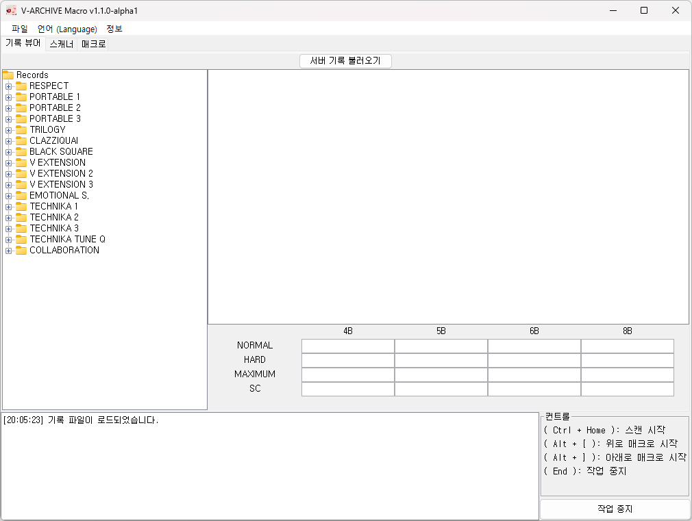

# VArchiveMacro

VArchiveMacro는 네오위즈(NEOWIZ)가 개발/배급하는 PC 플랫폼 게임 [DJMAX RESPECT V](https://store.steampowered.com/app/960170/DJMAX_RESPECT_V/)의 유저 제작 웹 성과 관리 도구 [V-ARCHIVE](https://v-archive.net/)의 클라이언트 캡처 자동화를 지원하는 외부 매크로 프로그램 입니다.

## 설치 안내

사용을 위해서는 *JRE 17 (Java Runtime Environment 17)* 이 필요합니다.

JRE설치 환경에 따라 다음 두 가지 실행 파일을 제공합니다.

- `VArchive Macro vX.X.X.exe`: 시스템 전역에 설치되어 있는 JRE를 사용합니다. [JavaSoft 레지스트리 키](https://docs.azul.com/core/zulu-openjdk/install/windows#azul-zulu-registry-keys)를 제공하는 JRE를 설치하였을 경우 사용 가능합니다.
- `VArchive Macro local vX.X.X.exe`: 로컬에 설치된 JRE를 이용합니다. 참조하는 JRE의 루트 폴더는 실행 파일과 동일한 경로에 `jre17` 이름으로 존재해야 합니다.

## 사용법

1. V-ARCHIVE 클라이언트와 VArchiveMacro를 같이 실행해주세요.
1. 프리스타일 화면으로 이동하여 V-ARCHIVE 클라이언트가 정상적으로 동작하는지 확인해주세요.
1. 곡 정렬 방법을 *난이도* 순서로 변경해주세요.
1. VArchiveMacro 프로그램 설정 후 단축키를 이용하여 매크로를 실행합니다.

### 단축키

- *Home*: 캡처를 시작합니다.
- *End*: 캡처를 중단합니다.
- *Ctrl + Up*: 곡 변경 방향을 위쪽으로 변경합니다.
- *Ctrl + Down*: 곡 변경 방향을 아래쪽으로 변경합니다.

## 설정

슬라이더가 있는 설정값은 마우스 우클릭으로 기본값 초기화가 가능하며, 슬라이더와 고급 설정의 좌측 라벨에 마우스를 올려두면 툴팁이 표시됩니다.

슬라이더로 설정 가능한 항목은 우측의 텍스트 입력란에 값을 입력하여 슬라이더 입력 범위를 일부 초과하는 값을 설정할 수 있습니다.

### 일반 설정

- 횟수: 캡처 횟수를 지정합니다.
- 이동 딜레이: 곡 변경에 걸리는 시간을 지정합니다. 값이 너무 작을 경우 곡 이동 중 캡처되어 V-ARCHIVE 클라이언트에서 정확한 분석을 할 수 없습니다.
- 분석 키: V-ARCHIVE 클라이언트에서 분석하기 위해 사용할 키를 지정해주세요.
- 이동 방향: 캡처 후 이동할 방향을 지정합니다. 캡처 시작 전 단축키로 빠르게 변경 가능합니다.

### 고급 설정

고급 설정은 캡처가 정상적이지 않거나 키 입력에 문제가 있는 경우 변경할 수 있는 설정값을 제공합니다.

- 캡처 키 입력 시간: 캡처 키를 누르고 있는 시간을 지정합니다.
- 키 입력 시간: 캡처 키를 제외한 다른 키들을 누르고 있는 시간을 지정합니다.

## 기타

- *VArchiveMacro의 앱 아이콘은 Over Me 곡의 커버 이미지에서 가져왔으며 이의 저작권은 NEOWIZ 사에 있습니다.*
