# 컬렉션 스캐너 사용법

## 소개

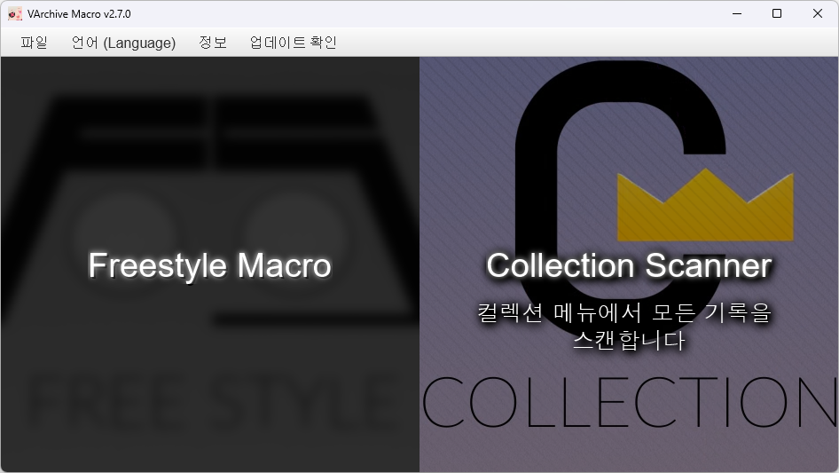

컬렉션 스캐너는 게임의 컬렉션 메뉴에서 기록을 직접 인식하고 V-ARCHIVE의 오픈 API를 통해 갱신한 기록들을 업로드할 수 있는 기능입니다.

## 주의사항

컬렉션 스캐너가 제 성능을 발휘하고 곡을 정확하게 인식하기 위해서는 다음 몇 가지 주의사항을 따라야 합니다.

1. 해상도 및 그래픽

   - 현재 다음과 같은 해상도를 지원합니다.

     - FHD (1920 x 1080) **(인식 정확도 가장 높음)**
     - WFHD (2560 x 1080)
     - QHD (2560 x 1440)

     이 외에도 **FHD 이상의 16:9 정수배 해상도**도 스캔이 가능하지만 곡 인식률이 낮을 수 있습니다.

   - 현재 다중 모니터 환경은 지원하지 않아 **게임을 주 모니터에 실행시켰을 때만 스캔이 가능합니다.**

   - HDR과 같은 그래픽 출력 색상을 변경하는 기능은 사용을 자제해주세요.

     컬렉션 스캐너는 주 모니터에 보여지는 화면을 그대로 캡처하고 이미지를 인식하여 작동하는데 HDR 등으로 이미지의 색상 또는 밝기 등이 변경된다면 인식이 정확히 이루어지지 않을 수 있습니다.

1. 게임 설정

   - 게임은 **전체화면 또는 보더리스 전체화면**으로 실행해주세요.

   - 게임 언어 설정은 **한국어 (KOREAN)** 로 설정해주세요.

## 사용법

1. 컬렉션 스캐너를 처음 실행한다면 자신의 기록들을 V-ARCHIVE 서버에서 불러와야 합니다.

   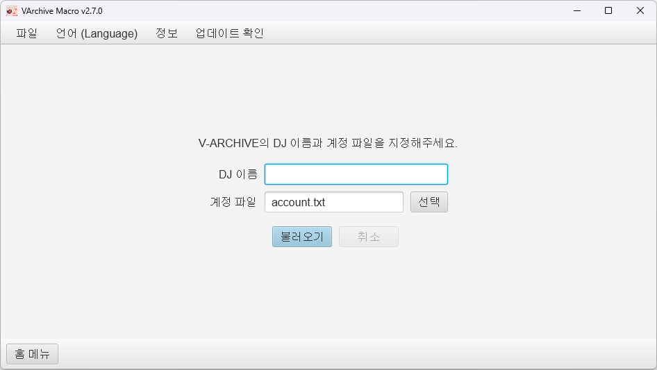

   자신의 V-ARCHIVE 계정 이름과 계정 파일을 지정한 후 불러오기 버튼을 눌러 기록을 불러오세요.

   - **DJ 이름**: V-ARCHIVE의 계정 이름을 입력해주세요.
   - **계정 파일**: V-ARCHIVE의 계정 파일 (`account.txt`) 을 지정해주세요. 계정 파일은 V-ARCHIVE 계정 생성 시 V-ARCHIVE 클라이언트가 있는 디렉토리에 자동으로 생성되며 기록 업로드에 필요한 정보를 담고 있습니다. 후에 기록 업로드 시 사용됩니다.

1. 기록을 불러오면 기록을 볼 수 있는 기록 뷰어가 보여집니다.

   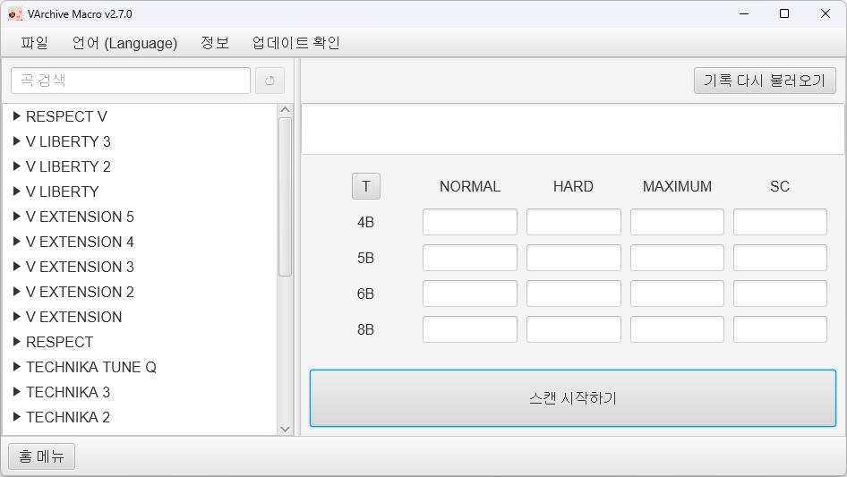

   이 곳에서 서버에서 불러와 저장한 기록들을 간단히 검색하여 볼 수 있습니다.

   - **기록 다시 불러오기**: 서버에서 기록을 다시 불러와야할 경우 이 메뉴를 통해 다시 불러올 수 있습니다.
   - **스캔 시작하기**: 스캔을 진행하기 위한 스캐너를 실행합니다.

1. 기록 뷰어에서 스캔 시작하기 버튼을 눌러 스캐너를 실행합니다.

   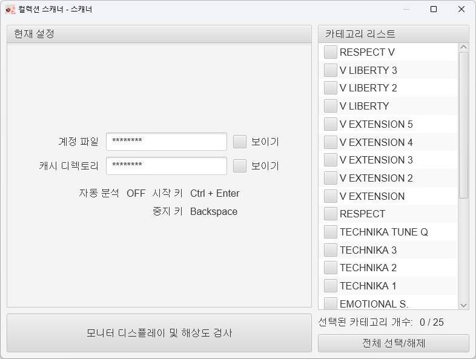

   기록 뷰어에서 스캔 시작하기 버튼을 누르면 스캔을 시작할 수 있는 스캐너 창이 뜨게됩니다. 이곳에서 스캔이 가능한 환경인지 간단히 검사할 수 있고 어느 카테고리를 스캔할 것인지 설정할 수 있습니다.

   - 모니터 디스플레이 및 해상도 검사: 스캔이 가능한 해상도인지, 또 다중 모니터 환경일 경우 어느 모니터를 캡처하는지 확인할 수 있습니다.

1. 스캐너 창에서 스캔할 카테고리를 선택합니다.

   스캐너의 우측 카테고리 리스트에서 어느 카테고리들을 스캔할 것인지 선택해주세요.

> [!CAUTION]
>
> **스캔할 카테고리를 선택할 때 아무것도 뜨지 않는 카테고리가 있다면 이 카테고리는 선택하지 마세요.**
>
> 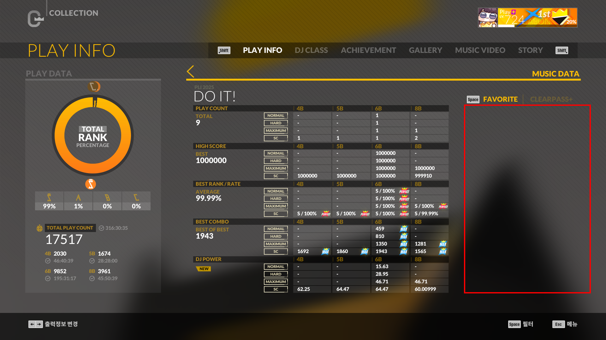
>
> 게임의 컬렉션 메뉴 카테고리 중에는 경우에 따라 위와 같이 어떠한 곡도 뜨지 않는 카테고리가 있을 수 있습니다. (사진은 임의로 연출한 예시) 이러한 카테고리는 카테고리가 변경되기 전 마지막으로 보았던 곡의 정보가 그대로 출력되어 잘못 인식될 수 있습니다.

> [!NOTE]
>
> **카테고리에 곡이 뜨지 않는 이유?**
>
> 곡은 버튼 및 패턴에 관계 없이 곡의 플레이 기록이 1회 이상 존재할 때에만 컬렉션 메뉴에 표시됩니다. (DLC 소지 여부 관계 없음) 어떠한 곡도 뜨지 않는 카테고리는 해당 카테고리로 분류된 모든 곡들의 플레이 횟수가 0인 경우입니다.

5. 스캔 준비가 다 되었으면 스캔을 시작합니다.

   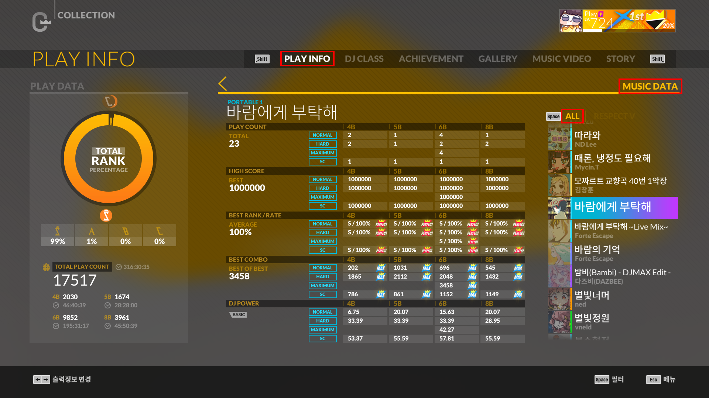

   **컬렉션 메뉴의 PLAY INFO 탭에서 오른쪽 방향키를 눌러 MUSIC DATA를 띄운 후 ALL 카테고리에서 시작 단축키 (기본값 `Ctrl + Enter`) 를 눌러 스캔을 시작하세요.** 스캔을 막 시작할 때 컴퓨터 사양에 따라 몇 초 정도의 시간이 걸릴 수 있습니다. 단축키를 누른 후 최소 5초 정도 여유있게 기다려주세요.

   스캔을 중지하려면 중지 단축키 (기본값 `Backspace`) 를 눌러주세요. 중지 단축키는 한 번 누르면 자동으로 ALL 카테고리로 돌아가며, 두 번 누르면 즉시 모든 동작이 중지됩니다.

   스캔이 완료되면 스캔 결과를 검토하고 어떠한 곡들의 기록이 갱신되었는지 확인 및 기록을 업로드할 수 있는 처리기 창이 뜨게됩니다.

> [!CAUTION]
>
> - **시작과 끝은 ALL 카테고리입니다.**
>
>   컬렉션 스캐너는 ALL 카테고리에서 스캔을 시작하고 스캔이 종료되면 자동으로 ALL 카테고리로 돌아옵니다. ALL 카테고리에서 시작하지 않았거나 스캔이 완료되었을 때 자동으로 ALL 카테고리로 돌아오지 않았다면 스캔에 이상이 있을 수 있으니 다시 스캔해주세요.
>
>   만약 문제가 지속된다면 FAQ를 참고하여 한 카테고리씩 스캔하거나 고급 설정을 변경한 후 스캔을 시도해주세요.
>
> - **스캔이 진행될 동안에는 키보드 및 마우스를 건드리지 마세요.**
>
>   컬렉션 스캐너는 자동으로 곡과 카테고리를 넘겨가며 인식합니다. 임의의 조작이 가해진다면 곡과 기록 인식에 이상이 발생할 수 있습니다.
>
> - **마우스 커서 또는 다른 창으로 인해 제목 및 기록란이 가려지면 안됩니다.**
>
>   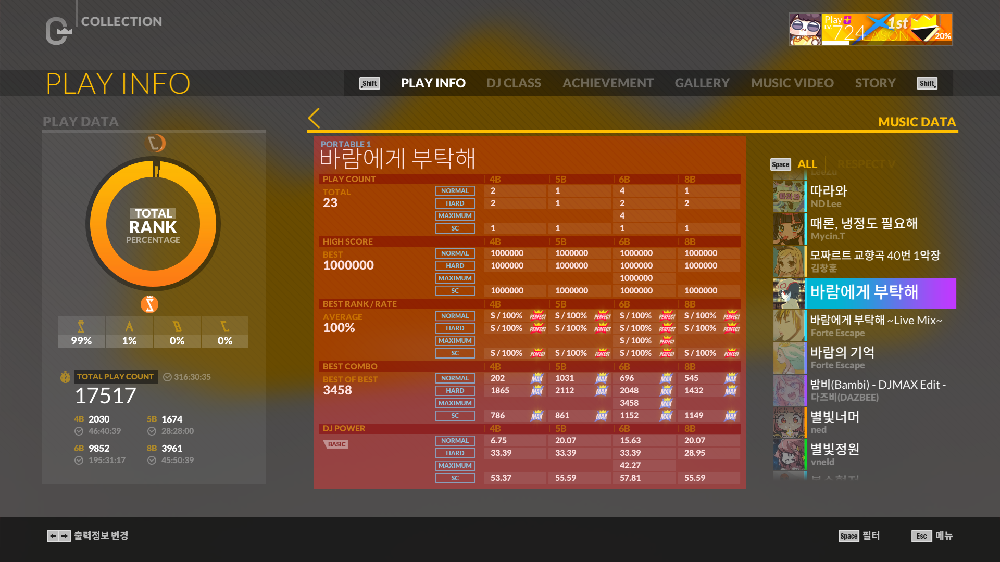
>
>   컬렉션 스캐너는 주 모니터에 보여지는 화면을 그대로 캡처하고 특정 영역의 텍스트를 OCR로 추출하여 데이터를 얻습니다. 때문에 위 사진의 영역과 같이 제목 및 기록 정보가 표시되는 영역이 마우스 커서나 다른 창 등으로 가려진다면 곡을 정확하게 인식하지 못하거나 기록이 잘못 추출될 수 있습니다.

6. 스캔이 완료되면 처리기의 검토 단계에서 정확히 스캔되었는지 확인합니다.

   스캔이 완료되면 가장 먼저 처리기의 검토 단계에서 곡들을 정확히 인식하였는지 확인하고 분석 및 업로드할 곡들을 선택해야 합니다.

   인식 정확도에 따라 필요한 조취는 다음과 같습니다.

   - **정확**

     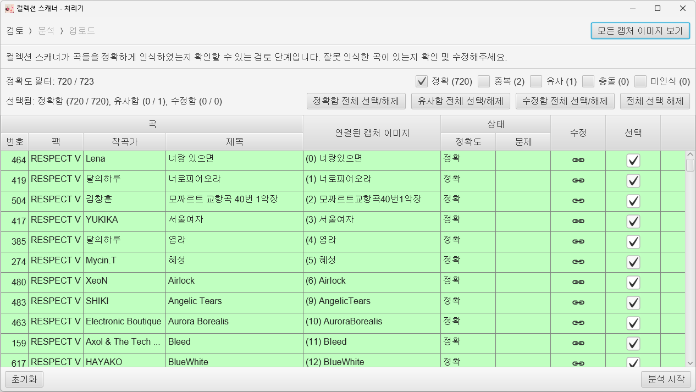

     100% 정확히 인식한 곡들은 정확 (초록색) 으료 표시되고 자동으로 선택되므로 별다른 조취가 필요하지 않습니다. (정확은 기본 숨김 필터이므로 표시되지 않습니다. 상단 필터를 변경하면 표시됩니다.)

   - **중복**

     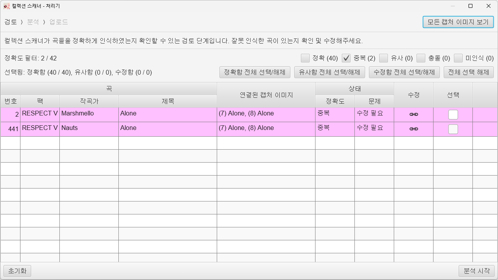

     100% 정확히 인식하였으나 제목과 카테고리가 동일하여 곡의 제목만으로는 구분이 불가능한 곡이 2개 이상이라면 중복 (보라색) 으로 표시됩니다.

     다음 두 곡이 이러한 경우에 해당합니다. (모두 RESPECT V 카테고리)

     - _Marshmello - Alone_
     - _Nauts - Alone_

     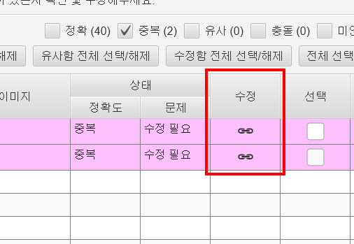

     이러한 곡들은 우측의 수정 버튼을 클릭 후 올바른 캡처 이미지를 선택하여 연결해주세요.

     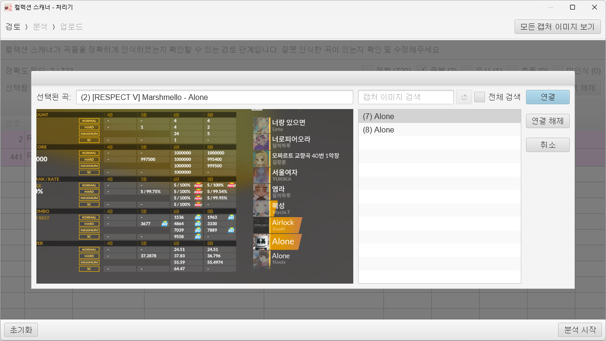

     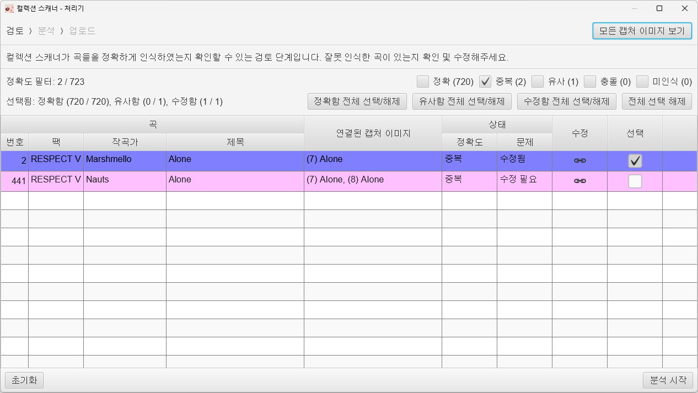

     연결을 수정하면 수정됨 상태 (파란색) 로 변경되며 자동으로 선택됩니다.

   - **유사**

     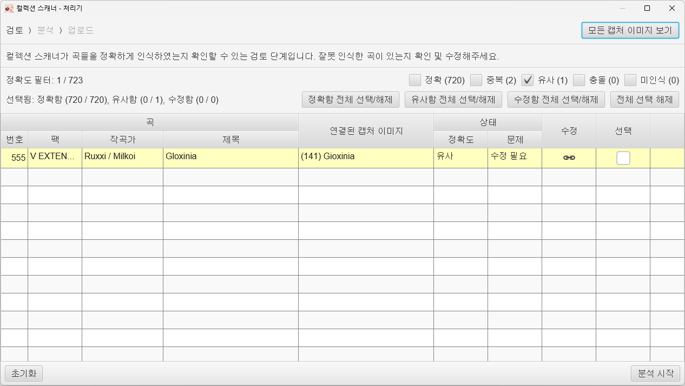

     정확하게 인식하지는 못하였으나 유력한 후보가 1개인 경우 유사 (노란색) 으로 표시됩니다.

     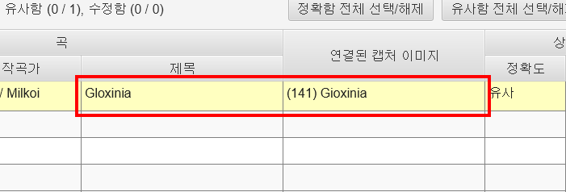

     이러한 곡들은 자동으로 선택되지 않으므로 좌측의 곡 제목과 우측의 캡처 이미지의 제목을 보고 올바른 캡처 이미지의 제목이라면 선택해주세요. 만약 올바르지 않다면 수정 버튼을 누르고 전체 검색에 체크한 후 올바른 이미지를 찾아 연결해주세요.

   - **충돌**

     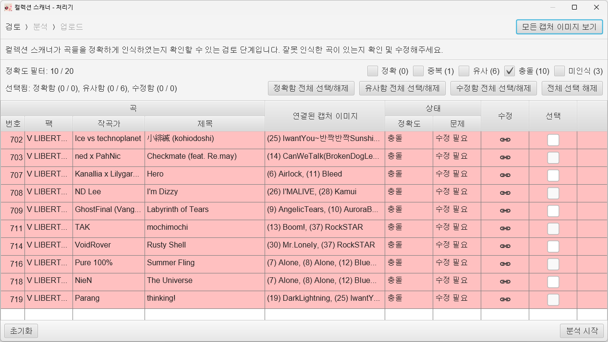

     정확하게 인식하지 못하였으며 동시에 후보군이 2개 이상인 경우 충돌 (빨간색) 으로 표시됩니다. (사진은 임의로 연출한 예시)

     이 경우 후보군에 정확한 캡처 이미지가 있다면 해당 이미지를 선택하거나 없다면 전체 검색하여 올바른 이미지를 연결해주세요.

   - **미인식**

     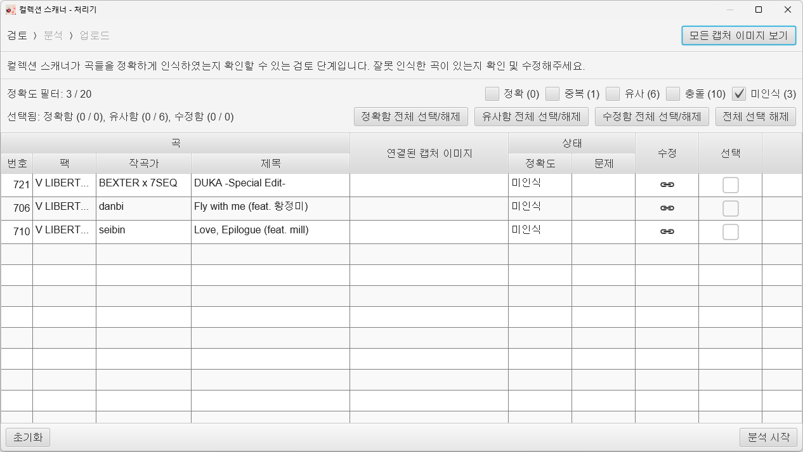

     곡의 플레이 기록이 전혀 없어 인식이 되지 않았거나 플레이 기록이 있음에도 제목이 정확히 인식되지 않아 기록이 없는 것으로 인식된 곡에 대해서는 미인식 (흰색) 으로 표시됩니다.

     플레이 기록이 있음에도 인식이 되지 않은 것이라면 수정 버튼을 눌러 올바른 캡처 이미지를 찾아 연결해주세요.

1. 검토가 끝나면 우측 하단의 분석 버튼을 눌러 분석을 시작합니다.

   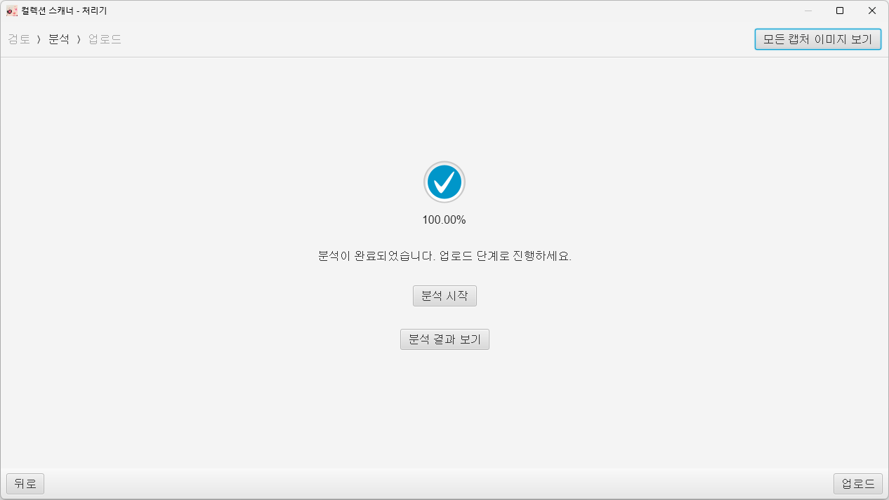

   이 과정에서 캡처한 이미지로부터 정확도 정보와 맥스 콤보 유무를 추출합니다.

   어떻게 추출하였는진 우측 상단 모든 캡처 이미지 보기 에서 확인할 수 있습니다.

   만약 설정에서 자동 분석 기능을 켜 놓았다면 검토 도중에 자동으로 진행됩니다.

1. 분석이 완료되면 우측 하단 업로드 버튼을 눌러 업로드 단계로 진행합니다.

   업로드 단계에서 불러왔던 기록들과 분석한 기록들을 비교하여 갱신한 기록들을 확인할 수 있습니다. 업로드하고자 하는 기록들을 선택하고 우측 하단 업로드 버튼을 눌러 업로드하세요.

   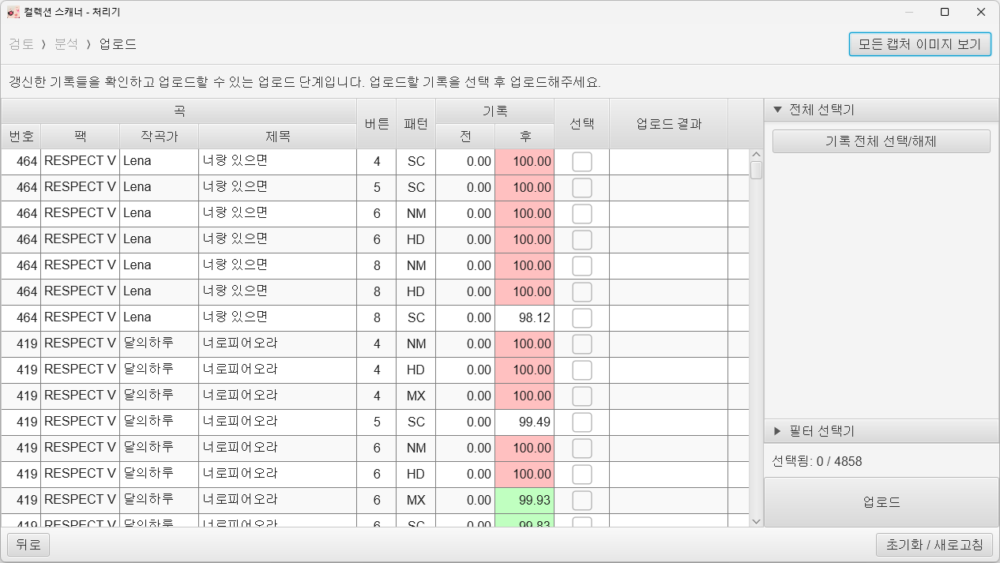

   우측의 전체 선택기를 이용하여 모든 기록을 선택하거나 필요한 경우 필터 선택기를 이용하여 버튼, 패턴, 맥스 콤보 여부에 따라 선택적으로 업로드할 수 있습니다.

## 설정 항목

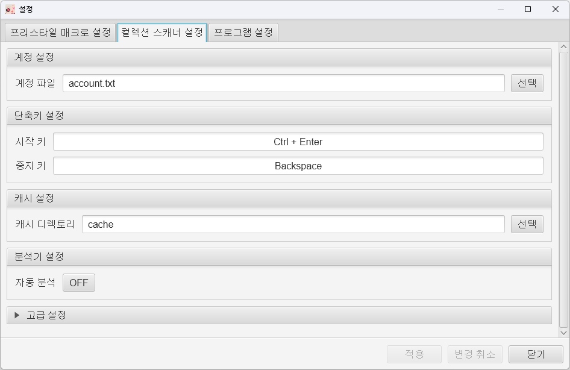

컬렉션 스캐너의 설정은 파일 - 설정 - 컬렉션 스캐너 설정 탭에서 변경할 수 있습니다.

1. 계정 설정

   - **계정 파일**: V-ARCHIVE의 계정 파일 (`account.txt`) 을 지정합니다.

1. 단축키 설정

   - **시작 키**: 스캔 시작 단축키를 지정합니다.
   - **중지 키**: 스캔 중지 단축키를 지정합니다.

1. 캐시 설정

   - **캐시 디렉토리**: 컬렉션 스캐너가 스캔하며 캡처한 이미지를 저장할 디렉토리를 지정합니다. 기본값은 컬렉션 스캐너의 실행 파일이 있는 디렉토리의 `cache` 디렉토리에 저장됩니다.

1. 분석기 설정

   - **자동 분석**: 스캔 완료 후 자동 분석을 실행할지 설정합니다. ON 설정 시 검토 단계 진행 도중 캡처한 모든 이미지에 대해 분석이 자동으로 실행됩니다.

1. 고급 설정

   컬렉션 스캐너 사용에 문제가 있을 때 변경하는 설정 항목입니다. [FAQ](collection_scanner_faq.md) 를 참고하여 변경하세요.

   - **분석기 스레드 수**: 분석 시 사용할 스레드의 수를 지정합니다.
   - **캡처 딜레이**: 캡처 후 다음 명령을 실행하기 전 스캐너를 일시정지할 시간을 지정합니다. 스캔 도중 렉이 걸리며 정상적으로 스캔이 되지 않을 때 변경합니다.
   - **키 누름 시간**: 컬렉션 스캐너가 가상으로 생성하는 키 입력 신호의 길이를 설정합니다. 신호의 길이가 너무 짧으면 곡 또는 카테고리가 넘어가지 않으며, 너무 길면 곡 또는 카테고리가 한 번에 여러 개가 넘어갈 수 있습니다. 가상 키 신호에 응답이 없을 때 변경합니다.

> [!TIP]
>
> 슬라이더가 있는 설정 항목들은 슬라이더에 마우스 우클릭을 하면 기본값으로 초기화할 수 있습니다.

## 문제 발생 시

문제 발생 시 [FAQ](collection_scanner_faq.md) 를 참고해주세요.
