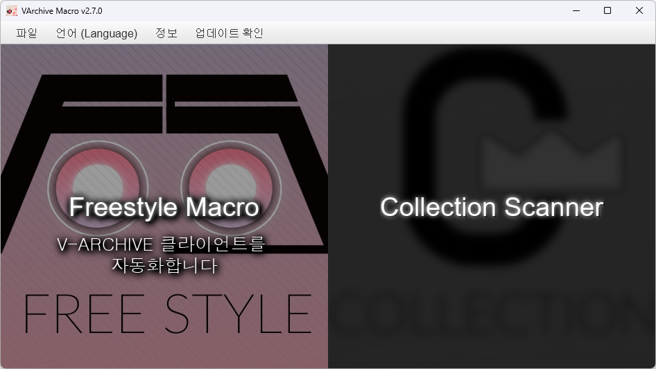
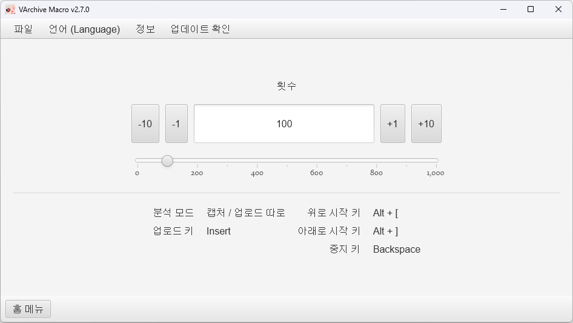
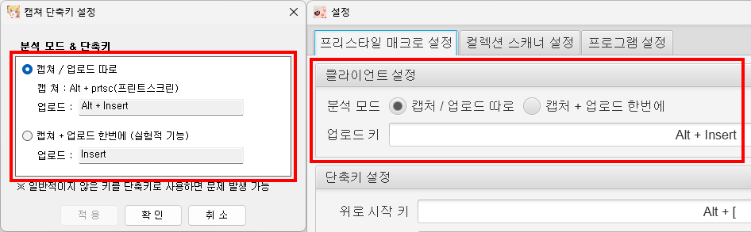
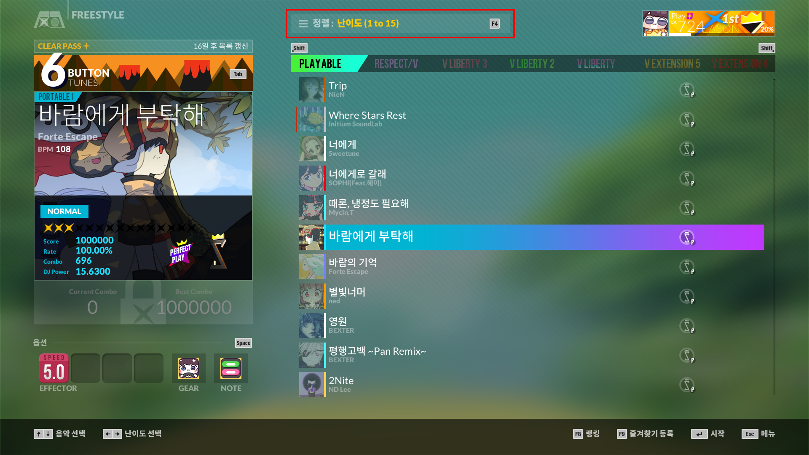
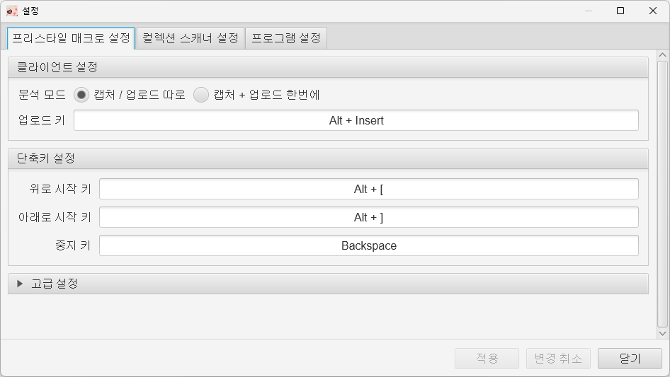

# 프리스타일 매크로 사용법

## 소개

프리스타일 매크로는 프리스타일 메뉴에서 작동하는 V-ARCHIVE 클라이언트의 반복 캡처를 자동화하는 기능입니다.

## 사용법

1. V-ARCHIVE 클라이언트와 프리스타일 매크로를 같이 실행합니다.

1. VArchiveMacro 의 상단 파일 - 설정 메뉴를 눌러 설정 창을 열고 다음과 같이 프리스타일 매크로 설정을 V-ARCHIVE 클라이언트의 단축키 설정과 동일하게 맞춰줍니다.

   

1. 게임의 프리스타일 메뉴에서 곡의 정렬 순서를 난이도 순서로 정렬합니다.

   

> [!NOTE]
>
> **난이도 순서로 정렬하는 이유?**
>
> 프리스타일 매크로는 단순히 _\[위 또는 아래로 곡 변경 - 프린트 스크린샷 - 분석 키\]_ 의 키 입력을 지정 횟수만큼 반복합니다. 문제는 위 또는 아래 방향 입력만 누르므로 기본 정렬이라면 좌우 입력이 필요한 패턴은 변경되지 않아 NORMAL 패턴의 기록들만 등록되게 됩니다. 반면에 난이도 순서로 정렬하면 위 또는 아래 방향 입력 만으로 모든 패턴을 볼 수 있게 되어 모든 기록을 등록할 수 있으므로 모든 기록을 등록하기 위해서는 난이도 순서로 정렬해야 합니다.

4. 프리스타일 매크로의 시작 단축키 (기본값 `Alt + [` 또는 `Alt + ]`) 를 눌러 매크로를 시작합니다.

1. 매크로는 지정한 횟수만큼 반복하면 자동으로 중지됩니다. 또는 도중에 중지 단축키 (기본값 `Backspace`) 를 눌러 중지할 수 있습니다.

## 설정 항목

프리스타일 매크로의 설정은 파일 - 설정 - 프리스타일 매크로 설정 탭에서 변경할 수 있습니다.

1. 클라이언트 설정

   - **분석 모드**: V-ARCHIVE 클라이언트가 사용하는 캡처 모드를 지정합니다.
   - **업로드 키**: V-ARCHIVE 클라이언트가 사용하는 캡처 단축키를 지정합니다.

1. 단축키 설정

   - **위로 시작 키**: 위 방향으로 매크로를 시작하는 단축키를 지정합니다.
   - **아래로 시작 키**: 아래 방향으로 매크로를 시작하는 단축키를 지정합니다.
   - **중지 키**: 매크로를 중지하는 단축키를 지정합니다.

1. 고급 설정

   프리스타일 매크로 사용에 문제가 있을 때 변경하는 설정 항목입니다. [FAQ](freestyle_macro_faq.md) 를 참고하여 변경하세요.

   - **곡 변경 시간**: 위 또는 아래로 움직이는 키를 입력한 후의 딜레이를 지정합니다. 곡 변경 후 맥스 콤보 마크가 정확히 출력되기를 기다리기 위해 사용됩니다.
   - **캡처 후 딜레이**: 캡처가 정확히 되기까지 매크로를 일시정지하는 시간을 지정합니다.
   - **키 누름 시간**: 프리스타일 매크로가 가상으로 생성하는 키 입력 신호의 길이를 설정합니다. 신호의 길이가 너무 짧으면 곡이 넘어가지 않거나 캡처가 정상적으로 되지 않으며, 너무 길면 곡이 한 번에 여러 번 넘어갈 수 있습니다. 가상 키 신호에 응답이 없을 때 변경합니다.

> [!TIP]
>
> 슬라이더가 있는 설정 항목들은 슬라이더에 마우스 우클릭을 하면 기본값으로 초기화할 수 있습니다.

## 문제 발생 시

문제 발생 시 [FAQ](freestyle_macro_faq.md) 를 참고해주세요.
