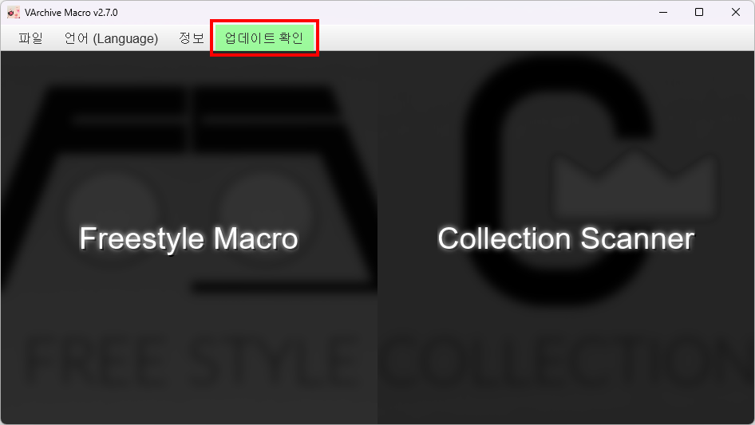

# 사용 설명서

이 문서는 VArchiveMacro 의 기능과 사용법, FAQ 등을 정리한 사용 설명서 문서입니다. 프로젝트에 대한 내용은 [깃허브 리포지토리](https://github.com/johypark97/VArchiveMacro) 를 참고해주세요.

## 기능 소개

VArchiveMacro 는 다음 두 가지 기능을 제공합니다.

### 프리스타일 매크로

프리스타일 매크로는 프리스타일에서 동작하는 V-ARCHIVE 클라이언트의 반복 캡처를 자동화하는 기능입니다. V-ARHCIVE 클라이언트의 높은 호환성을 필두로 일부 난이도대 기록만 빠르게 추출하고자 한다면 이 기능을 이용해주세요.

- [프리스타일 매크로 사용법](freestyle_macro_manual.md)

- [프리스타일 매크로 FAQ](freestyle_macro_faq.md)

### 컬렉션 스캐너

컬렉션 스캐너는 컬렉션 메뉴에서 전곡을 스캔하는 기능입니다. 전곡 기록을 추출하고자 한다면 이 기능을 이용해주세요. 단, V-ARCHIVE 클라이언트에 비해 사용법이 다소 복잡하고 사용할 수 있는 환경에 제약이 있습니다. 또한 V-ARCHIVE와 업데이트가 별개로 진행되므로 신곡 추가등의 변경이 있을 때 별도의 컬렉션 스캐너 데이터 업데이트가 있기 전 까지는 사용이 불가능할 수 있습니다.

- [컬렉션 스캐너 사용법](collection_scanner_manual.md)

- [컬렉션 스캐너 FAQ](collection_scanner_faq.md)

## 업데이트 안내

VArchiveMacro 가 실행될 때 자동으로 새로운 업데이트가 있는지 확인하여 업데이트가 있다면 상단의 업데이트 확인 메뉴가 초록색으로 강조됩니다.

- 새 버전 업데이트가 있는 경우 깃허브 릴리즈 페이지로 안내됩니다. 설치된 VArchiveMacro 를 삭제한 후 새 버전을 다운받아 재설치해주세요.
- 컬렉션 스캐너 데이터 업데이트가 있는 경우 자동 업데이트가 가능합니다. 메뉴 클릭 후 자세히 보기 창에서 업데이트 버튼을 눌러 업데이트를 진행해주세요. 업데이트가 완료되면 프로그램을 재시작해주세요.

> [!TIP]
>
> 컬렉션 스캐너 데이터 업데이트로 새로운 곡 카테고리가 추가된 경우 컬렉션 스캐너 사용 전 스캔할 카테고리를 다시 확인해주세요.

## 업데이트 내역

[업데이트 내역](version_history.md) 문서를 참고해주세요.
